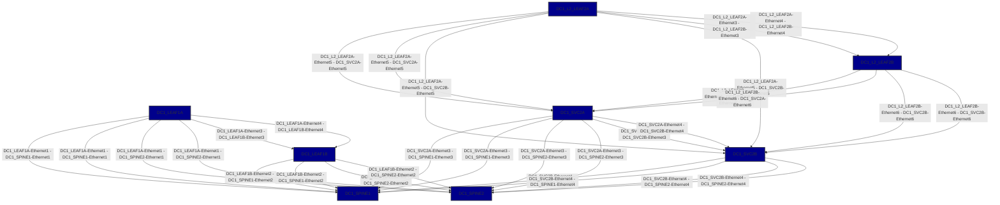

```mermaid

        graph TD
            
            DC1_SPINE1[DC1_SPINE1];
            
            DC1_SPINE2[DC1_SPINE2];
            
            DC1_LEAF1A[DC1_LEAF1A];
            
            DC1_LEAF1B[DC1_LEAF1B];
            
            DC1_SVC2A[DC1_SVC2A];
            
            DC1_SVC2B[DC1_SVC2B];
            
            DC1_L2_LEAF2A[DC1_L2_LEAF2A];
            
            DC1_L2_LEAF2B[DC1_L2_LEAF2B];
            
            
            DC1_LEAF1A -- DC1_LEAF1A-Ethernet1 - DC1_SPINE1-Ethernet1 --> DC1_SPINE1;
            
            DC1_LEAF1A -- DC1_LEAF1A-Ethernet1 - DC1_SPINE1-Ethernet1 --> DC1_SPINE1;
            
            DC1_LEAF1B -- DC1_LEAF1B-Ethernet2 - DC1_SPINE1-Ethernet2 --> DC1_SPINE1;
            
            DC1_LEAF1B -- DC1_LEAF1B-Ethernet2 - DC1_SPINE1-Ethernet2 --> DC1_SPINE1;
            
            DC1_SVC2A -- DC1_SVC2A-Ethernet3 - DC1_SPINE1-Ethernet3 --> DC1_SPINE1;
            
            DC1_SVC2A -- DC1_SVC2A-Ethernet3 - DC1_SPINE1-Ethernet3 --> DC1_SPINE1;
            
            DC1_SVC2B -- DC1_SVC2B-Ethernet4 - DC1_SPINE1-Ethernet4 --> DC1_SPINE1;
            
            DC1_SVC2B -- DC1_SVC2B-Ethernet4 - DC1_SPINE1-Ethernet4 --> DC1_SPINE1;
            
            DC1_LEAF1A -- DC1_LEAF1A-Ethernet1 - DC1_SPINE2-Ethernet1 --> DC1_SPINE2;
            
            DC1_LEAF1A -- DC1_LEAF1A-Ethernet1 - DC1_SPINE2-Ethernet1 --> DC1_SPINE2;
            
            DC1_LEAF1B -- DC1_LEAF1B-Ethernet2 - DC1_SPINE2-Ethernet2 --> DC1_SPINE2;
            
            DC1_LEAF1B -- DC1_LEAF1B-Ethernet2 - DC1_SPINE2-Ethernet2 --> DC1_SPINE2;
            
            DC1_SVC2A -- DC1_SVC2A-Ethernet3 - DC1_SPINE2-Ethernet3 --> DC1_SPINE2;
            
            DC1_SVC2A -- DC1_SVC2A-Ethernet3 - DC1_SPINE2-Ethernet3 --> DC1_SPINE2;
            
            DC1_SVC2B -- DC1_SVC2B-Ethernet4 - DC1_SPINE2-Ethernet4 --> DC1_SPINE2;
            
            DC1_SVC2B -- DC1_SVC2B-Ethernet4 - DC1_SPINE2-Ethernet4 --> DC1_SPINE2;
            
            DC1_L2_LEAF2A -- DC1_L2_LEAF2A-Ethernet5 - DC1_SVC2A-Ethernet5 --> DC1_SVC2A;
            
            DC1_L2_LEAF2A -- DC1_L2_LEAF2A-Ethernet5 - DC1_SVC2A-Ethernet5 --> DC1_SVC2A;
            
            DC1_L2_LEAF2A -- DC1_L2_LEAF2A-Ethernet5 - DC1_SVC2B-Ethernet5 --> DC1_SVC2B;
            
            DC1_L2_LEAF2A -- DC1_L2_LEAF2A-Ethernet5 - DC1_SVC2B-Ethernet5 --> DC1_SVC2B;
            
            DC1_L2_LEAF2B -- DC1_L2_LEAF2B-Ethernet6 - DC1_SVC2A-Ethernet6 --> DC1_SVC2A;
            
            DC1_L2_LEAF2B -- DC1_L2_LEAF2B-Ethernet6 - DC1_SVC2A-Ethernet6 --> DC1_SVC2A;
            
            DC1_L2_LEAF2B -- DC1_L2_LEAF2B-Ethernet6 - DC1_SVC2B-Ethernet6 --> DC1_SVC2B;
            
            DC1_L2_LEAF2B -- DC1_L2_LEAF2B-Ethernet6 - DC1_SVC2B-Ethernet6 --> DC1_SVC2B;
            
            DC1_LEAF1A -- DC1_LEAF1A-Ethernet3 - DC1_LEAF1B-Ethernet3 --> DC1_LEAF1B;
            
            DC1_LEAF1A -- DC1_LEAF1A-Ethernet4 - DC1_LEAF1B-Ethernet4 --> DC1_LEAF1B;
            
            DC1_SVC2A -- DC1_SVC2A-Ethernet3 - DC1_SVC2B-Ethernet3 --> DC1_SVC2B;
            
            DC1_SVC2A -- DC1_SVC2A-Ethernet4 - DC1_SVC2B-Ethernet4 --> DC1_SVC2B;
            
            DC1_L2_LEAF2A -- DC1_L2_LEAF2A-Ethernet3 - DC1_L2_LEAF2B-Ethernet3 --> DC1_L2_LEAF2B;
            
            DC1_L2_LEAF2A -- DC1_L2_LEAF2A-Ethernet4 - DC1_L2_LEAF2B-Ethernet4 --> DC1_L2_LEAF2B;
            
            
            style DC1_SPINE1 fill:#00008B,stroke:#333,stroke-width:2px
            
            style DC1_SPINE2 fill:#00008B,stroke:#333,stroke-width:2px
            
            style DC1_LEAF1A fill:#00008B,stroke:#333,stroke-width:2px
            
            style DC1_LEAF1B fill:#00008B,stroke:#333,stroke-width:2px
            
            style DC1_SVC2A fill:#00008B,stroke:#333,stroke-width:2px
            
            style DC1_SVC2B fill:#00008B,stroke:#333,stroke-width:2px
            
            style DC1_L2_LEAF2A fill:#00008B,stroke:#333,stroke-width:2px
            
            style DC1_L2_LEAF2B fill:#00008B,stroke:#333,stroke-width:2px
            
        
```